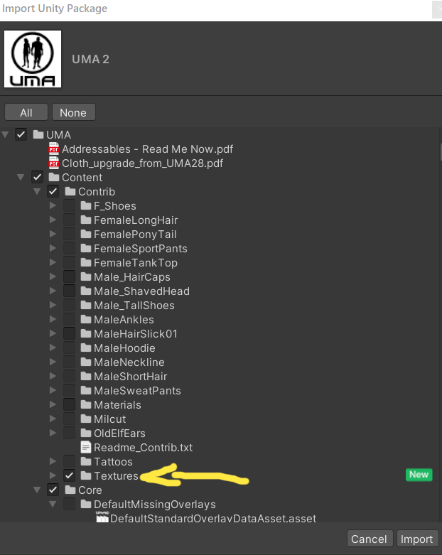

# Ancient Anaesthesia

## Demo project of face punching

## How to make it work
When you just start it you can see this:

You need import [UMA 2](https://assetstore.unity.com/packages/3d/characters/uma-2-35611), but textures only. Follow the screenshots:

